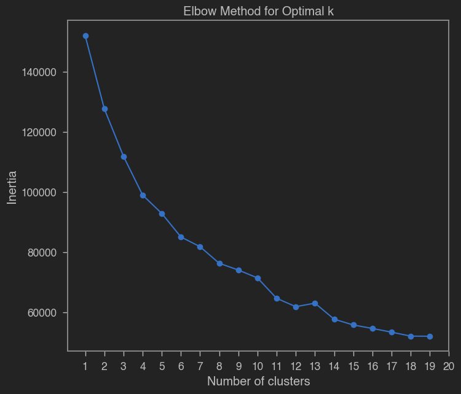
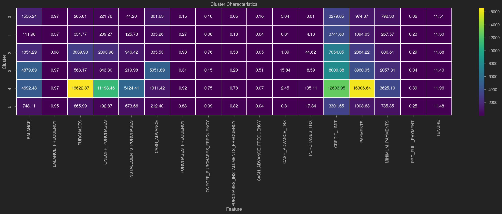
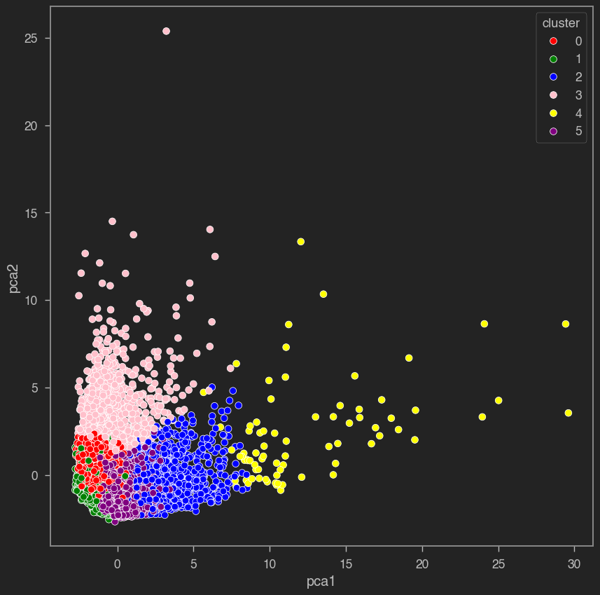

# Customer Segmentation Analysis
[Overview](#overview) | [Key Features](#key-features) | [Cluster Descriptions](#cluster-descriptions) | [How to Install](#how-to-install) | [Credits](#credits)

## Overview
This script performs customer segmentation analysis using K-means clustering, an unsupervised machine learning (ML) technique, on a marketing dataset. The goal is to group customers based on their purchasing behavior and other features, providing valuable insights for targeted marketing strategies.

## Key Features
- Data preprocessing to handle missing values and duplicates.
- Visualization of histograms to understand the distribution of features.
- Determination of the optimal number of clusters using the elbow method.

- K-means clustering to group customers into distinct segments.

- Saving cluster centers and summary to a file for further analysis.
- Visualizing clusters in a scatter plot using principal component analysis (PCA).


## Cluster Descriptions

### Cluster 0 (Careful Spenders):

Description: These customers are cautious with their spending and prefer to pay off their balances in full.

Key Characteristics:
- Low balance ($1500) and cash advance ($800).
- Low purchase frequency (0.16) and moderate credit limit (~$3300).
- Moderate payments made and minimum payments (~$975 and ~$790, respectively).
- Low percentage of full payment (2.18%).

### Cluster 1 (Low Activity):

Description: Customers in this cluster have relatively low activity on their credit cards.

Key Characteristics:
- Low balance ($110) and cash advance ($335).
- Low purchase frequency (0.27) and credit limit (~$3740).
- Moderate payments made and low minimum payments (~$1094 and ~$268, respectively).
- Moderate percentage of full payment (23.09%).

### Cluster 2 (Active Users):

Description: These customers are active users of their credit cards, making frequent purchases and paying off their balances.

Key Characteristics:
- Moderate balance ($1850) and cash advance ($336).
- High purchase frequency (0.93) and credit limit (~$7054).
- High payments made and moderate minimum payments (~$2884 and ~$807, respectively).
- High percentage of full payment (28.52%).

### Cluster 3 (Heavy Cash Users):

Description: Customers in this cluster heavily rely on cash advances and have moderate purchase activity.

Key Characteristics:
- High balance ($4880) and cash advance ($5052).
- Moderate purchase frequency (0.31) and credit limit (~$8001).
- High payments made and high minimum payments (~$3961 and ~$2057, respectively).
- Low percentage of full payment (3.90%).

### Cluster 4 (High Spenders):

Description: These customers are high spenders with substantial credit limits and frequent purchases.

Key Characteristics:
- High balance ($4692) and cash advance ($1011).
- Very high purchase frequency (0.92) and credit limit (~$12604).
- Very high payments made and high minimum payments (~$16307 and ~$3625, respectively).
- High percentage of full payment (38.96%).

### Cluster 5 (Moderate Users):

Description: Customers in this cluster have moderate spending habits and tenure.

Key Characteristics:
- Moderate balance ($748) and cash advance ($212).
- High purchase frequency (0.88) and credit limit (~$3302).
- Moderate payments made and minimum payments (~$1009 and ~$735, respectively).
- Moderate percentage of full payment (25.15%).


## How to Install
1. Install the required Python packages:
```bash
    pip install pandas numpy seaborn matplotlib scikit-learn jupyterthemes
```
2. Clone the repository:
```bash
    git clone https://github.com/nmcintyre5/customerSegmentation.git
```  
3. Navigate to the project directory:
```bash
    cd customerSegmentation
```  
4. Run the main script `customer_segmentation.py`:
```bash
    python customerSegmentation.py
```  
5. View the generated plots and output files for insights into customer segmentation.

## Credits
This script is based off of the Coursera course "Unsupervised Machine Learning for Customer Market Segmentation" by Ryan Ahmed, Adjunct Professor & AI Enthusiast.

## Additional Tags
#CustomerSegmentation #DataAnalysis #Clustering #MarketingAnalytics #KMeans #PCA #DataVisualization
